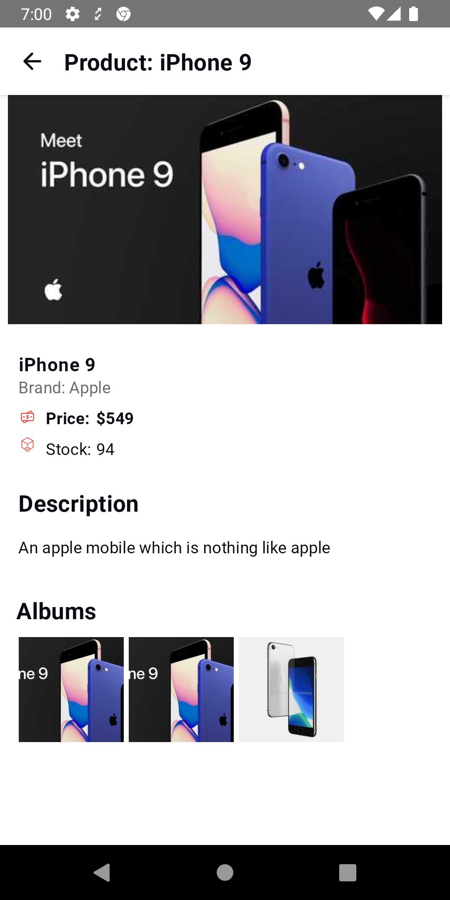

# Shoppy Mobile Dev Test

## Overview

- I decided to rewrite the majority of the App in compose as its the latest tech stack and works
  well if you scale it up with features with a working design system
- The app follows a MVVM architecture and clean code principles and uses hilt to mange DI
- It uses roomDb to store data
- Im using retrofit as a network library to fetch task data
- Have added Shimmer Effect as Loading Placeholders
- Comments: Usually in practise I use detailed PRs to explain about the code rather than leaving
  comments when absolutely necessary

## Features

- Simple app to search dummy product data and store network requests to DB for offline use
- Falls back to db for data if network errors or offline
- Uses https://dummyjson.com/ for data
    - see: https://github.com/Ovi/DummyJSON for API documentation

## Modularization

- The app is modularied with multiple modules for faster build time and gradle caching
    - App
        - Main Module with applications and dependencies to all modules
        - Entry point of the app
    - Network
        - Module handling network requests and retrofit
    - Common
        - Module containing all common shared resources ex CorutineDispachers etc
    - Persistance
        - Module containing logic for storing data to DB using roomDB
    - Feature
        - Usually each feature is supposed to have its own module but due to the small nature of the
          App single module is used
        - Contains Viewmodels, screens (compose views), and Repository to fetch data
    - DesignSystem
        - Having a common design for an app is good for UX and consistancy
        - It also makes writing common features a breeze with compose as a lot of components can be
          reused
        - All Color, Typography data is store here as well

## Testing

- I'm using Fakes to test viewmodel, repository and usecases as there is no need for mocking and
  final classes can be used easily
- Im also injecting Coroutine dispatchers so its easier to replace with Test dispatchers while
  testing suspended functions

## Screenshots

- Please see screenshots attached
- 
- 
- 
- 

## Build

- Check Release tab
